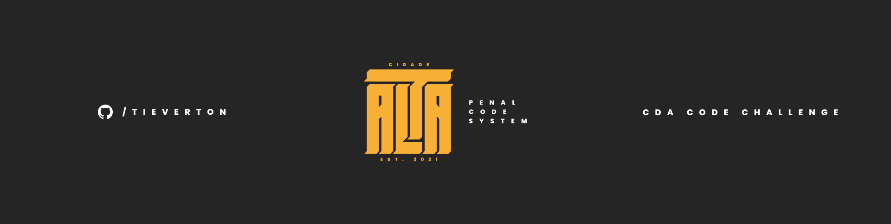

<h1 align="center">
  
</h1>
<h1 align="center">
  Challenge | Cidade Alta
</h1>
<p align="center">
  <a href="#-project">Project</a>&nbsp;&nbsp;&nbsp;|&nbsp;&nbsp;&nbsp;
  <a href="#-technologies">Technologies</a>&nbsp;&nbsp;&nbsp;|&nbsp;&nbsp;&nbsp;
  <a href="#-preview">Preview</a>&nbsp;&nbsp;&nbsp;|&nbsp;&nbsp;&nbsp;
  <a href="#-layout">Layout</a>&nbsp;&nbsp;&nbsp;|&nbsp;&nbsp;&nbsp;
  <a href="#-getting-started">Getting started</a>&nbsp;&nbsp;&nbsp;
</p>
<p align="center">
  <a href="https://www.linkedin.com/in/evertonpinheiroti/"></a>
  </a>
    
  <a href="https://github.com/TIEverton/challenge-cda/stargazers">
    
  </a>
</p>

## 💻 Project

The project consists of the development of a system to control the criminal codes of the Police Department of the Upper City. For this, an application was built where the user will authenticate and after success you will be able to consult, include, edit, delete and view the criminal codes of Cidade Alta.

## ✨ Technologies

- [React](https://reactjs.org)
- [TypeScript](https://www.typescriptlang.org/)
- [Redux](https://redux.js.org/)
- [Styled Components](https://styled-components.com/)
- [Yup](https://github.com/jquense/yup)
- [Unform](https://unform.dev/)
- [uuid](https://github.com/uuidjs/uuid#readme)
- [react-icons](https://react-icons.github.io/react-icons/)
- [react-modal](https://github.com/reactjs/react-modal)
- [react-toastify](https://fkhadra.github.io/react-toastify/)

## 🔥 Preview

You can view the production version through the button below <br><br>
[](https://challenge-cda.vercel.app/)

## 🔖 Layout

You can view the layout of the project through [this link](https://www.figma.com/file/7tufF9S9PCJe92VTulANcy/UI-CDA-Challenge?node-id=0%3A1). You must have an account at [Figma] (http://figma.com/) to access it.

## 🚀 Getting started

Clone the project and access the folder

```bash
$ git clone https://github.com/TIEverton/challenge-cda.git && cd challenge-cda
```

Follow the steps below

```bash
# Install the dependencies
$ yarn

# Start the project
$ yarn start
```

You can now access [`localhost:3000`](http://localhost:3000) from your browser.

---

Done with ♥ by Everton Pinheiro 👋🏻 
